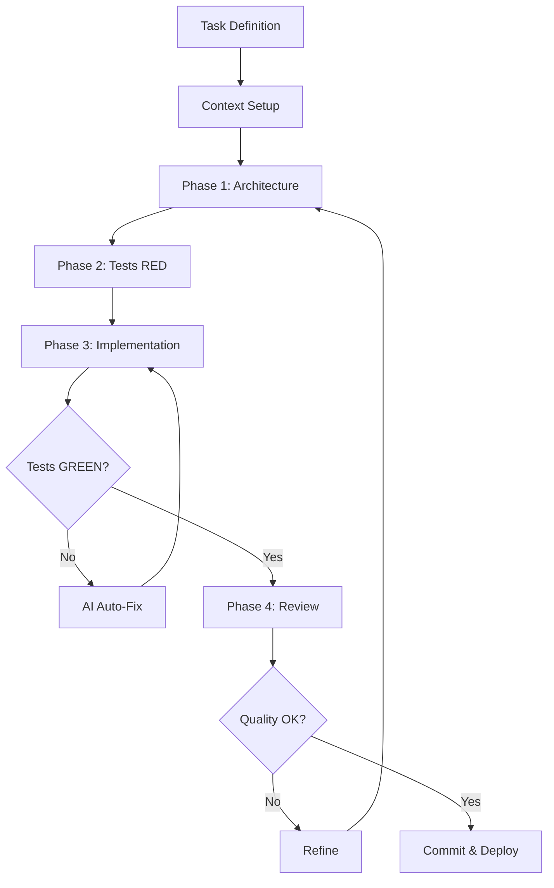

# Uso Efficace dell'AI per Senior Devs

## 📖 Concetti Base

### Cos'è AI-TDD?
**AI Test-Driven Development**: metodologia dove l'AI scrive prima i test, poi il codice per passarli.

**Flusso tradizionale (problematico con AI):**
```
Tu scrivi spec → AI genera codice → Tu debuggi manualmente
```

**Flusso AI-TDD (efficace):**
```
AI scrive test → AI genera codice → AI verifica test → AI autocorregge → Tu revisioni
```

**Vantaggi:**
- AI ha criterio oggettivo (test pass/fail)
- Autocorrezione automatica invece di debug manuale
- Codice con coverage integrata da subito

### Cos'è Waterfall?
**Approccio sequenziale rigido**: pianifichi tutto prima, poi esegui in blocco.

**Esempio Waterfall con AI (❌ sbagliato):**
```
Prompt: "Crea sistema e-commerce completo: 
- 15 modelli database
- API REST complete
- Frontend React
- Sistema pagamenti
- Email notifications
- Admin panel"
```
**Risultato**: 2000 righe di codice con 20+ errori nascosti, 4 ore di debug.

**Approccio Incrementale (✅ corretto):**
```
Iterazione 1: "Crea modello Prodotto + test CRUD"
Iterazione 2: "Aggiungi carrello con test validazione"
Iterazione 3: "Integra pagamento con mock + test"
...
```
**Risultato**: Ogni pezzo funziona prima di passare al successivo.

## 🚫 Errori Comuni

| Cosa NON fare | Perché fallisce | Come correggerlo |
|---------------|-----------------|------------------|
| Mega-prompt monolitici | Context drift, errori accumulati | Spezza in task <5 file |
| Waterfall (tutto subito) | AI perde coerenza su progetti grandi | Approccio incrementale |
| Copy-paste manuale | Inefficiente, propenso a errori | Usa IDE AI integrati |
| Assenza regole fisse | Ogni iterazione cambia stile | Context pinning |
| Prompt vaghi | Output generico/sbagliato | Prompt strutturati (vedi template) |

## ✅ Principi Fondamentali

### 1. Approccio Incrementale (con Architettura Evolutiva)
**Regola base**: Se ci vogliono >10 minuti per descrivere il task, è troppo grande.

**Come spezzare:**
```
❌ "Crea sistema autenticazione"
✅ "Crea modello User con hash password + test"
✅ "Aggiungi endpoint login con JWT + test"
✅ "Implementa middleware auth + test"
```

**⚠️ CRITICO: Predisponi per Evoluzione**

Quando aggiungi funzionalità incrementalmente, **l'architettura deve essere pronta alle aggiunte future** per evitare refactoring massicci o bug nascosti.

**Problemi da prevenire SUBITO:**

| Problema | Quando emerge | Come prevenire dall'inizio |
|----------|---------------|----------------------------|
| **Race Conditions** | Aggiungi concorrenza dopo | Usa transazioni/lock fin da subito, anche se sincrono |
| **Memory Leaks** | Aggiungi listener/stream | Pattern dispose/cleanup in ogni risorsa |
| **Tight Coupling** | Aggiungi terzo servizio | Interfaces/DI dal primo servizio |
| **State Inconsistency** | Aggiungi cache/replica | Single source of truth + event sourcing |
| **Deadlock** | Aggiungi lock multipli | Lock ordering strategy documentata |
| **N+1 Queries** | Dataset cresce | Eager loading strategy da subito |

**Esempio pratico - Sistema Ordini:**

```typescript
// ❌ Approccio ingenuo (iterazione 1)
class OrderService {
  createOrder(items: Item[]) {
    const order = db.orders.create({items});
    inventory.decrease(items); // Race condition futura!
    return order;
  }
}

// ✅ Architettura predisposta (iterazione 1)
class OrderService {
  async createOrder(items: Item[]) {
    // Transaction fin da subito (anche se ora è sincrono)
    return db.transaction(async (tx) => {
      const order = await tx.orders.create({items});
      
      // Lock pessimistico predisposto
      await tx.inventory.decreaseWithLock(items);
      
      // Event bus predisposto (anche se listener vuoto ora)
      await eventBus.publish('order.created', order);
      
      return order;
    });
  }
}

// Iterazione 2: Aggiungi notifiche
// → Aggiungi listener a eventBus, nessun refactoring core

// Iterazione 3: Aggiungi pagamento asincrono
// → Transaction già presente, nessuna race condition
```

**Checklist Architettura Evolutiva:**

Quando crei il PRIMO componente, chiedi all'AI:

```
"Implementa [FEATURE] predisponendo per:
1. Concorrenza: usa transazioni/lock anche se ora sincrono
2. Scalabilità: interfacce per dipendenze esterne
3. Observability: logging strutturato + metriche hook
4. Failure handling: retry logic + circuit breaker pattern
5. State management: eventi per ogni cambio stato critico

Commenta dove aggiungere logica futura senza refactoring."
```

**Pattern Fondamentali per Crescita:**

### 🎯 Perché i Pattern sono CRITICI con LLM

**Problema core:** Le LLM tendono a generare codice procedural/monolitico perché minimizza la "distanza" tra prompt e output. Ma questo crea debito tecnico massiccio.

**I pattern architetturali servono a:**
1. **Vincolare l'AI** in strutture predicibili (meno allucinazioni)
2. **Permettere iterazioni** senza riscrivere codice esistente
3. **Rendere testabile** ogni pezzo isolatamente
4. **Comunicare intent** (l'AI capisce meglio "usa Repository" che 300 righe di SQL)

---

#### 1. Repository Pattern
**Cosa fa:** Isola accesso dati dietro interfaccia.

**Perché con LLM:**
```typescript
// ❌ Senza pattern - L'AI deve riscrivere TUTTO se cambi DB
class UserService {
  getUser(id: string) {
    return db.query('SELECT * FROM users WHERE id = ?', [id]);
    // SQL embedded ovunque, impossibile testare, locked-in su DB
  }
}

// ✅ Con Repository - L'AI modifica SOLO l'implementazione
interface IUserRepository {
  findById(id: string): Promise<User>;
}

class UserService {
  constructor(private repo: IUserRepository) {}
  
  getUser(id: string) {
    return this.repo.findById(id);
    // Service non cambia mai, anche se passi da SQL a MongoDB
  }
}
```
**Beneficio LLM:** Prompt "Aggiungi cache Redis" → L'AI crea `CachedUserRepository` che wrappa quello esistente, **zero refactoring**.

---

#### 2. Event-Driven Architecture
**Cosa fa:** Disaccoppia produttori e consumatori tramite eventi.

**Perché con LLM:**
```typescript
// ❌ Senza eventi - Ogni nuova feature richiede modifica core
class OrderService {
  createOrder(data: OrderData) {
    const order = db.orders.create(data);
    emailService.sendConfirmation(order); // Accoppiamento stretto
    analyticsService.track(order);        // Cresce all'infinito
    inventoryService.decrease(order);     // Fragile, non scalabile
    return order;
  }
}

// ✅ Con eventi - Aggiungi feature SENZA toccare core
class OrderService {
  createOrder(data: OrderData) {
    const order = db.orders.create(data);
    eventBus.publish('order.created', order);
    return order;
  }
}

// Iterazione 2: Aggiungi listener
eventBus.on('order.created', sendEmail);
// Iterazione 3: Aggiungi altro listener
eventBus.on('order.created', trackAnalytics);
```
**Beneficio LLM:** Prompt "Aggiungi notifica SMS ordine" → L'AI crea nuovo listener, **OrderService mai toccato**.

---

#### 3. Strategy Pattern
**Cosa fa:** Algoritmi intercambiabili tramite interfaccia comune.

**Perché con LLM:**
```typescript
// ❌ Senza Strategy - L'AI deve modificare logica esistente
class PricingService {
  calculate(items: Item[], userType: string) {
    if (userType === 'premium') {
      // 50 righe di calcolo
    } else if (userType === 'student') {
      // 50 righe diverse
    } // L'AI deve capire e modificare tutto
  }
}

// ✅ Con Strategy - L'AI aggiunge nuova classe indipendente
interface IPricingStrategy {
  calculate(items: Item[]): number;
}

class PremiumPricing implements IPricingStrategy {
  calculate(items: Item[]) { /* logica isolata */ }
}

class StudentPricing implements IPricingStrategy {
  calculate(items: Item[]) { /* logica isolata */ }
}
```
**Beneficio LLM:** Prompt "Aggiungi pricing Black Friday" → L'AI crea `BlackFridayPricing`, **zero rischio su codice esistente**.

---

#### 4. Dependency Injection
**Cosa fa:** Dipendenze passate dall'esterno, non create internamente.

**Perché con LLM:**
```typescript
// ❌ Senza DI - Impossibile testare, accoppiamento hard
class OrderService {
  private mailer = new EmailService(); // Hard-coded
  
  createOrder(data: OrderData) {
    // Come testo senza mandare email vere?
  }
}

// ✅ Con DI - Testabile e sostituibile
class OrderService {
  constructor(
    private mailer: IEmailService,  // Interfaccia
    private repo: IOrderRepository
  ) {}
}

// Test
const mockMailer = { send: jest.fn() };
const service = new OrderService(mockMailer, mockRepo);
```
**Beneficio LLM:** 
- Prompt "Scrivi test per OrderService" → L'AI usa mock facilmente
- Prompt "Sostituisci email con SendGrid" → L'AI crea implementazione, costruttore immutato

---

#### 5. Factory Pattern
**Cosa fa:** Centralizza logica di creazione complessa.

**Perché con LLM:**
```typescript
// ❌ Senza Factory - Logica sparsa, duplicata
function processPayment(type: string) {
  let processor;
  if (type === 'stripe') {
    processor = new StripeProcessor(config.stripe.key, config.stripe.secret);
  } else if (type === 'paypal') {
    processor = new PayPalProcessor(config.paypal.client);
  }
  // Duplicato in 10 file diversi
}

// ✅ Con Factory - Single source of truth
class PaymentProcessorFactory {
  create(type: PaymentType): IPaymentProcessor {
    switch(type) {
      case 'stripe': return new StripeProcessor(this.config.stripe);
      case 'paypal': return new PayPalProcessor(this.config.paypal);
    }
  }
}
```
**Beneficio LLM:** Prompt "Aggiungi Braintree" → L'AI modifica SOLO Factory, tutti i chiamanti funzionano automaticamente.

---

### 📊 Matrice Pattern vs Problema LLM

| Problema LLM | Pattern Soluzione | Risultato |
|--------------|-------------------|-----------|
| Codice monolitico difficile iterare | Repository + DI | Modifiche chirurgiche |
| Allucinazioni su dipendenze | Interfacce esplicite | Contract verificabile |
| Difficoltà testare | DI + Strategy | Mock semplici |
| Refactoring massiccio ogni feature | Event-Driven | Estensioni non invasive |
| Context overflow (troppe righe) | Factory + Strategy | Classi piccole, focus ristretto |
| Duplicazione logica | Factory | Single source of truth |

**Regola d'oro:** Se l'AI deve leggere >500 righe per aggiungere una feature, l'architettura è sbagliata.

**Validazione step:**
- Ogni step produce codice eseguibile
- Test verdi prima di procedere
- Max 3-5 file modificati per step
- **Architettura permette prossimi 3 step senza refactoring**

### 2. Tooling Appropriato
**Chat Web**: Consulenza, brainstorming, domande rapide  
**IDE AI** (Cursor, Windsurf): Sviluppo con contesto progetto completo  
**CLI Tools** (Aider): Automazione, batch operations, CI/CD

**Esempio decisione:**
- "Come strutturare API REST?" → Chat Web
- "Implementa API utenti con test" → IDE AI
- "Converti 50 file da JS a TS" → CLI Tool

### 3. Context Pinning
**Problema**: AI "dimentica" regole dopo 3-4 iterazioni.

**Soluzione**: File di contesto sempre presente.

**Template `.cursorrules`:**
```
# Stack
- Language: TypeScript 5.x
- Framework: NestJS
- DB: PostgreSQL + Prisma
- Testing: Jest

# Regole Codice
- Naming: camelCase variabili, PascalCase classi
- NO any type (usa unknown)
- NO console.log (usa Logger)
- Sempre async/await (NO callbacks)

# Architettura
- Pattern: Repository Pattern
- Struttura: /src/modules/[feature]/{controller,service,repository,dto}
- Validation: class-validator su tutti i DTO

# Testing
- Coverage minimo: 80%
- Mock esterni (DB, API)
- Test file: *.spec.ts accanto al file
```

### 4. AI-TDD Flow Dettagliato
```
1. TEST (RED)
   ↓ AI scrive test che descrivono comportamento atteso
   ↓ Test falliscono (funzione non esiste)
   
2. CODE (GREEN)
   ↓ AI implementa per passare test
   ↓ Esegue test automaticamente
   ↓ Se falliscono → auto-corregge e ripete
   
3. REFACTOR
   ↓ AI migliora codice mantenendo test verdi
   ↓ Tu revisioni architettura, non bug
```

## 📋 Template: Prompt Agentico Universale

```
RUOLO: [Senior Developer nel dominio X]

TASK: [Descrizione funzionalità target]

VINCOLI ARCHITETTURALI (OBBLIGATORI):
Predisponi il codice per evoluzione futura considerando:
- Concorrenza: transazioni DB, lock strategy, idempotenza
- Scalabilità: interfacce per dipendenze, injection pattern
- Resilienza: retry logic, timeout, circuit breaker placeholder
- Observability: structured logging, metrics hooks
- Estensibilità: eventi per ogni state change, plugin system ready

PROCESSO OBBLIGATORIO:

=== FASE 1: ARCHITETTURA ===
Output richiesto:
- Struttura file/cartelle
- Interfacce/contratti pubblici + dependency injection
- Pattern utilizzati (Repository, Strategy, Factory, etc)
- Diagramma dipendenze (se >3 componenti)
- **Punti di estensione futura** (dove aggiungere feature senza refactor)
STOP: Non implementare ancora

=== FASE 2: SPECIFICA ESEGUIBILE ===
Scrivi test che coprano:
✓ Happy path
✓ Edge cases (null, empty, invalid)
✓ Error handling
✓ **Concorrenza** (se applicabile: race conditions, deadlock)
✓ **Idempotenza** (operazioni ripetute = stesso risultato)
Nota: I test DEVONO fallire (RED)

=== FASE 3: IMPLEMENTAZIONE ===
- Scrivi codice per passare test Fase 2
- Includi:
  * Transaction boundaries chiari
  * Resource cleanup (try-finally, using, defer)
  * Error boundaries
  * Structured logging nei punti critici
- [Se tool con esecuzione]: Esegui test, correggi errori autonomamente
- Output solo quando GREEN

=== FASE 4: QUALITY GATE ===
Verifica autonoma:
- Performance bottlenecks (N+1 query, memory leaks)
- Security issues (injection, exposure dati sensibili)
- Concurrency issues (race conditions, deadlock possibili)
- Code smells (duplicazione, coupling, god objects)
- Conformità regole context
- **Punti di fragilità per aggiunte future**
Correggi prima di mostrare output

OUTPUT FINALE:
[Codice + Test + Decisioni architetturali + Mappa estensioni future]
```

## 🔧 Prompt Rapidi per Situazioni Comuni

### Debug Assistito
```
Ho questo errore: [ERRORE]
Contesto: [file coinvolti]
Analizza causa root, proponi 3 soluzioni ordinate per rischio.
Implementa la più sicura solo dopo mia conferma.
```

### Refactoring Sicuro
```
Refactorizza [COMPONENTE] per [OBIETTIVO].
1. Scrivi test caratterizzazione esistente
2. Esegui test (devono passare)
3. Refactorizza
4. Conferma test ancora verdi
5. Mostra diff
```

### Code Review
```
Rivedi questo codice come senior reviewer:
[CODICE]
Cerca: security, performance, maintainability, edge cases.
Fornisci feedback costruttivo con esempi di fix.
```

### Documentazione Generativa
```
Genera docs per [COMPONENTE]:
- README: quick start, requisiti
- API reference: ogni metodo pubblico
- Examples: 3 use cases comuni
Stile: [conciso/dettagliato]
```

## 🎯 Decision Matrix: Quale Tool Usare

| Scenario | Tool Consigliato | Motivo |
|----------|------------------|--------|
| Prototipo veloce | Chat Web | Nessun setup richiesto |
| Feature completa | IDE AI (Cursor) | Contesto intero progetto |
| Automazione pipeline | CLI (Aider) | Scriptable, CI/CD friendly |
| Review/consulenza | Chat Web + Web Search | Accesso info aggiornate |
| Refactoring massiccio | IDE AI + Agent mode | Auto-correzione su molti file |

## 📊 Metriche di Successo

**Prima dell'AI-TDD:**
- Debug manuale: 40-60% del tempo
- Primo output funzionante: <30%

**Dopo l'AI-TDD:**
- Debug manuale: <10% del tempo
- Primo output funzionante: >80%

## 💡 Pro Tips

1. **Versiona i prompt**: Salva i prompt efficaci come template
2. **Feedback loop**: Se l'output è sbagliato, migliora il prompt, non solo il codice
3. **Progressive disclosure**: Rivela complessità gradualmente (prima interfacce, poi implementazione)
4. **Semantic commits**: Fai commit dopo ogni fase del processo agentico
5. **Fallback plan**: Se l'AI fallisce 3 volte, semplifica il task o cambia approccio

## 🔗 Workflow Completo



## 🚀 Quick Start (3 Step)

1. **Setup Context**
   ```bash
   # Crea .cursorrules o CONTEXT.md
   echo "Stack: [tuo stack]" > .cursorrules
   echo "Patterns: [tuoi pattern]" >> .cursorrules
   ```

2. **Primo Task con AI-TDD**
   - Scegli feature piccola (<5 file)
   - Usa template prompt agentico
   - Segui processo fase per fase

3. **Itera e Ottimizza**
   - Salva prompt efficaci
   - Aggiorna context con pattern emersi
   - Scala a task più complessi

---

**Remember**: L'AI è un amplificatore. Un processo sbagliato amplificato rimane sbagliato. Investi tempo nel setup del metodo, risparmierai 10x nel lungo periodo.
