# Event-Driven Agentic AI — Cheatsheet

---

## 1. Cosa è l'Agentic AI?

Sistemi autonomi di agenti che possono **ragionare, pianificare e agire** senza intervento umano. A differenza dei modelli generativi passivi, gli agenti sono proattivi: iniziano azioni, orchestrano gli step, reagiscono a condizioni mutevoli e coinvolgono l'uomo quando necessario.

---

## 2. Use Cases principali

- **Customer Service** — agenti che risolvono richieste e imparano dalle interazioni
- **Real-Time Operational Intelligence** — query in natural language su sistemi come order/inventory management
- **Customer Support Enhancement** — insights in real-time integrati con CRM, raccomandazioni per risoluzione ticket
- **Knowledge Management** — piattaforma che sintetizza informazioni tra i compartimenti aziendali
- **Employee Onboarding Automation** — workflow multi-agent (IT, finance, facilities) attivati da hiring events

---

## 3. Key Business Requirements

| Requirement | Cosa significa |
|---|---|
| **Openness** | Evitare vendor lock-in, usare protocolli standardizzati |
| **Fast Recognition** | Risposta in near-real-time agli eventi |
| **Unified Intelligence** | Accesso cross-domain a data streams, documenti, record |
| **Modular Design** | Componenti loosely coupled e swappable |
| **Elastic Scale** | Supporto a workload stateless e long-running |
| **Security & Governance** | Auth, policy enforcement, auditabilità a ogni livello |
| **Robustness** | Fallback, retry, dead-letter queue, escalation a human |

---

## 4. Protocolli chiave

- **A2A (Agent2Agent)** — comunicazione standardizzata tra agenti di vendor diversi
- **MCP (Model Context Protocol)** — permette agli agenti di usare tools/API esterne (bridge verso OpenAPI)

> A2A e MCP non sono rivali: A2A gestisce la comunicazione **tra agenti**, MCP gestisce l'accesso agli **strumenti e sistemi esterni**.

---

## 5. Perché Event-Driven Architecture (EDA)?

- **Loose Coupling** — gli agenti comunicano tramite events, non chiamate point-to-point
- **Fault Resistance** — isolamento dei failure; se un agente cade, gli altri continuano
- **Scalabilità** — il broker funziona da shock absorber, gli agenti scalano orizzontalmente
- **Cross-environment connectivity** — l'event mesh connette agenti che operano in cloud, edge e on-premises in modo trasparente
- **Flexibility** — nuovi agenti si aggiungono senza riscrivere il sistema

---

## 6. Come funziona il flusso (Orchestration)

1. Un evento/richiesta entra tramite **Gateway**
2. L'**Orchestrator** usa un LLM per dividere la richiesta in subtask
3. I subtask vengono delegati agli **agenti** competenti
4. Gli agenti eseguono i subtask e restituiscono i risultati all'**Orchestrator**
5. L'Orchestrator verifica la completezza, sintetizza e invia la risposta finale

---

## 7. Reference Architecture

---

> ### 💡 Nota: Orchestrator vs Event Mesh — due livelli, un sistema
>
> Le sezioni 6 e 7 mostrano due prospettive dello stesso sistema, non due architetture diverse:
>
> - L'**Orchestrator** è il cervello: pianifica, delega i subtask agli agenti e assembla la risposta finale. È il livello della **logica di controllo**.
> - L'**Event Mesh** è il sistema nervoso: trasporta i messaggi tra tutti i componenti (Gateway, Orchestrator, Agenti, sistemi Enterprise) in modo disaccoppiato (loose coupling) e resiliente. È il livello del **trasporto**.
>
> In pratica: l'Orchestrator *decide cosa fare*, l'Event Mesh *fa arrivare i messaggi*. Ogni comunicazione tra componenti passa fisicamente per l'Event Mesh, ma logicamente l'Orchestrator coordina il flusso. I due lavorano sempre insieme.

---

## 8. Real-Time Data: 3 ruoli fondamentali

```mermaid
flowchart TD
    RT[Real-Time Data] --> T1[🔥 Trigger workflows]
    RT --> T2[📚 Enrich decision-making\n Popola vector DB per RAG]
    RT --> T3[⚡ Accelerate action\n Contesto aggiornato per risposte rapide]
```

---

## 9. A2A vs MCP — differenza rapida

| Protocollo | Ruolo |
|---|---|
| **A2A** | Comunicazione **agent ↔ agent** across boundaries |
| **MCP** | Accesso agent → **tools / API / sistemi** |

---

## 10. Resilience & Observability

- **Agent versioning** — ogni agente è versionabile e deployabile indipendentemente via CI/CD pipelines
- **Retry logic** + **dead-letter queues** per messaggi non processati
- **Fallback agents** con comportamento di default
- **Human-in-the-loop** tramite decision queues e event gateways
- **Logging contextuale**: non solo *cosa* è andato storto, ma *perché*
- **Decision chain auditing** + **data lineage** per compliance
- **Zero-trust** e **secure-by-default** ovunque

---

## 11. Checklist: come iniziare

- [ ] Prototipa con gli sviluppatori, valuta i framework (LangGraph, CrewAI, MetaGPT, ecc.)
- [ ] Mappa gli **events** tra i domini in cui gli agenti possono ascoltare e agire
- [ ] Pilota **multi-agent workflows** per scenari business-critical
- [ ] Definisci policy per **trust, safety, governance**
- [ ] Misura l'impatto in **business value**, non solo accuracy/uptime
- [ ] Assicura architettura enterprise-ready, non solo PoC

---

## 12. Concetti chiave — Glossario rapido

| Termine | Significato |
|---|---|
| **Agent** | Unità autonoma con skill specifica |
| **Orchestrator** | Componente che pianifica e delega task agli agenti |
| **Event Mesh** | Backbone di comunicazione distribuita con loose coupling |
| **Gateway** | Punto di ingresso degli events nel sistema |
| **RAG** | Retrieval-Augmented Generation |
| **Vector DB** | Database per embeddings e similarità semantica |
| **Dead-Letter Queue** | Coda per messaggi non processabili |
| **Human-in-the-loop** | Pattern di validazione manuale integrata nel flusso |
| **Loose Coupling** | Dipendenze minime tra componenti |
| **EDA** | Event-Driven Architecture |
| **Broker** | Intermediario EDA che gestisce routing, buffering e isolamento dei failure |
| **CI/CD Pipelines** | Processo automatizzato per build, test e deploy degli agenti |
